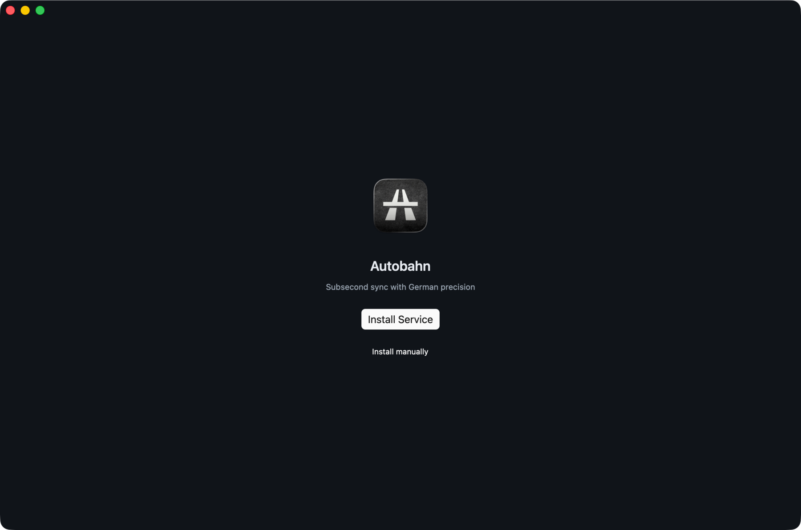
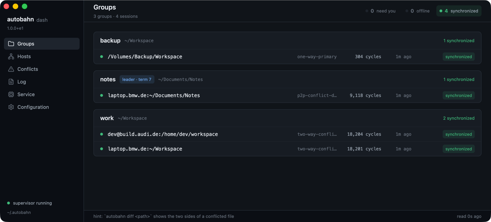
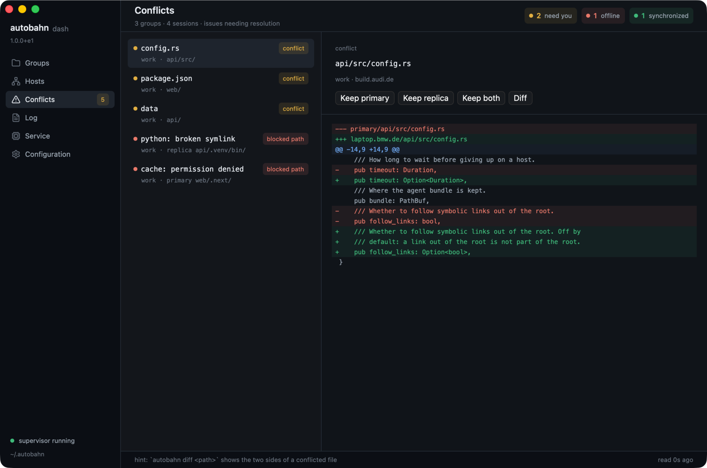
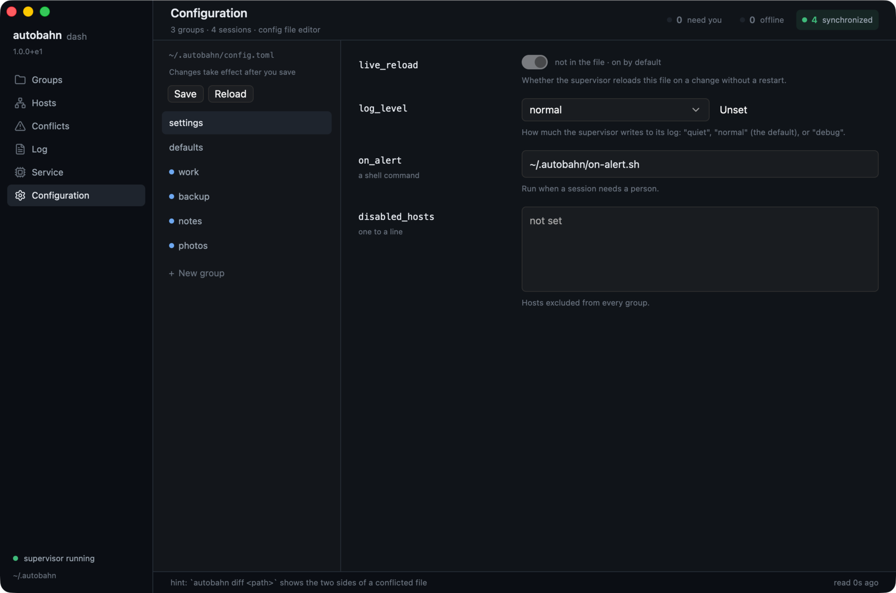
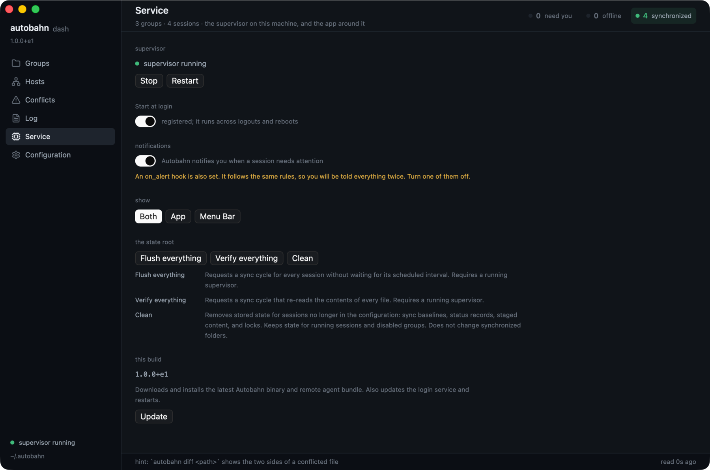

# Autobahn Dash

A window over the fleet: groups, hosts, conflicts, the log, service controls, and a configuration editor. It watches the supervisor rather than replacing it — the supervisor runs whether Dash is open or not.

Dash also carries [the menu bar item](./tray.md), and you choose whether to show the window, the item, or both.

## Getting it

Dash is built by the `dash.yml` workflow and published to the moving `dash-latest` prerelease: macOS Apple Silicon and Linux x86-64/arm64. This channel is unsigned and separate from the signed command-line releases. A platform whose build failed is simply absent, so check the release notes for the build commit and what it contains.

- **macOS** — open `Autobahn Dash.app`. These builds are not Developer ID signed or notarised, so a downloaded copy is quarantined; the release notes explain the step to clear it.
- **Linux** — extract the archive and run `./autobahn-dash`, keeping the companion `autobahn` executable beside it. You need a graphical session (Wayland or X11), a Vulkan driver, and the desktop libraries the workflow lists.

## First run



Dash needs the `autobahn` command. It looks beside itself first, then in `~/.local/bin`, `/usr/local/bin`, `/opt/homebrew/bin`, and your PATH.

If it finds none, a welcome screen offers to run the installer for you or to copy the shell command and run it yourself. Installer output goes to `install.log` under the state root, and the Log pane shows it as it happens.

Then configure a group before starting the service — see [Installation](../INSTALL.md).

Keep the command matched to the running supervisor. A version mismatch is reported in the status area rather than left to surprise you.

## The panes



| Pane | What it does |
|---|---|
| **Groups** | The configured groups, their destinations, current work, and anything wrong. |
| **Hosts** | The same sessions collected by host, with host controls. |
| **Conflicts** | Disagreements and diffs, with actions to keep one side or both. |
| **Log** | The supervisor log, or installer output during setup. |
| **Service** | Program and service state, with install, start, stop, restart, and cleanup. |
| **Config** | Top-level settings, defaults, and groups, which can be added, renamed, or removed. |

Conflict actions run the same operations as the command line — see [Conflicts](./conflicts.md). Dash never merges file contents. A conflict can be about a file's executable bit, a symbolic link, or a directory, so there is not always a text difference to show.

**Diff** puts the two sides underneath, labelled by side rather than by the files actually compared:



## Editing configuration



Edits stay in the form until you press **Save**. The editor checks them through Autobahn's own configuration loader and marks errors on the fields they belong to; an invalid configuration is never written. **Reload** reads the file again and throws away pending changes. Optional switches keep the difference between inheriting a value and setting it deliberately.

Advanced fields fold away. Experimental controls appear after five clicks on the Autobahn wordmark; what they mean and what they risk is in [Configuration](./configuration.md), [Alerts](./alerts.md), and [P2P](./p2p.md).

A running supervisor picks up a saved file through [live reload](./configuration.md#live-reload-behavior). With live reload off, restart it to apply the change.

## Choosing what shows



In the Service pane, pick a window, [a menu bar item](./tray.md), or both. The default is both.

The choice is this machine's, and so is the notification switch above it. Both are saved in `dash.toml` under the state root, which is not part of the fleet configuration:

```toml
presence = "both"   # both, window, or menubar
notify = true       # whether the app raises desktop notifications itself
```

## Notifications

Dash raises desktop notifications under exactly the rules an `on_alert` hook would use: a condition has to hold before it counts, only something *joining* the set in trouble is news, a cascade is gathered into one, and recovery is silent. See [Alerts](./alerts.md).

This does not depend on showing a menu bar item. A window with no menu bar still notifies — choosing where the app appears is not a choice about whether anything tells you a session has halted. Exactly one thing speaks per app: the menu bar item when there is one, the window when there is not.

Turn them off with the switch in the Service pane.

**Do not leave them on alongside an `on_alert` hook.** The hook follows the same rules, so both means being told everything twice. The Service pane says so when it finds a hook configured and the switch still on; turn off whichever you want less. A hook you add while Dash is open is noticed within a few seconds, without a restart.

## Starting at login

**Dash does not start itself.** Add it under System Settings → General → Login Items on macOS, or your desktop's autostart settings on Linux.

**The supervisor is separate.** `autobahn install`, or the service controls in the Service pane, registers it to start at login. That is what keeps your files in sync; Dash only watches it.

## Options

`--config FILE` and `--state-root DIRECTORY`. Without them Dash uses the default configuration and state root (`AUTOBAHN_HOME`, or `~/.autobahn`).

## On Linux

Dash runs from the `dash-latest` archives, including its menu bar item — though the item is the half most likely not to appear. The tray libraries need GTK started on the thread running the event loop, and neither GPUI nor winit provides one, so expect the window and treat the item as a bonus. A failure there leaves the window up with a one-line complaint rather than taking the app down.

## See also

- [The menu bar item](./tray.md) — what Dash puts in the menu bar, and the standalone app
- [Alerts](./alerts.md) — the rules behind every notification
- [Conflicts](./conflicts.md) — what the resolve actions do
- [The shop](./shop.md) — the terminal counterpart
- [Development](./development.md#desktop-app-and-shared-text) — building it
- [Releases](./releases.md#signing-and-notarising-macos) — signing and notarising
